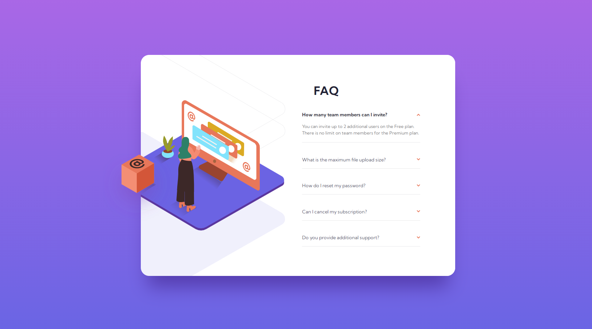
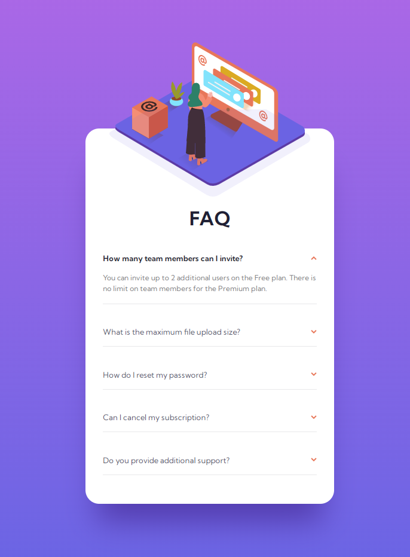

# Frontend Mentor - FAQ accordion card solution

## Table of contents

- [Overview](#overview)
  - [Screenshot](#screenshot)
  - [Links](#links)
- [My process](#my-process)
  - [Built with](#built-with)
  - [What I learned](#what-i-learned)
  - [Continued development](#continued-development)
  - [Useful resources](#useful-resources)
- [Acknowledgments](#acknowledgments)

## Overview

This is a solution to the [FAQ accordion card challenge on Frontend Mentor](https://www.frontendmentor.io/challenges/faq-accordion-card-XlyjD0Oam).

### Screenshot

### Links

- Solution URL: [Solution URL here](https://github.com/NunuAbuashvili/FAQ-Accordion-Card.git)
- Live Site URL: [Live Site URL here](https://nunuabuashvili.github.io/FAQ-Accordion-Card/)

## My process

### Built with

- Semantic HTML5 markup
- CSS custom properties
- Flexbox
- CSS Grid
- Mobile-first workflow
- JavaScript

### What I learned

Even though its design may look simple, this was a challenging project to work on. First of all, I had a rough idea of what to do in JavaScript, but I ran into some difficulties in the process, for example, adding event listener to multiple elements, so that the relevant answer would show/hide when the question was clicked, and not only the first one. As for the HTML and CSS, I spent a quality amount of time on positioning some items, including the background pattern and the brown box, both for the desktop view.

### Continued development

I would like to work more on JavaScript in future projects. Also, now if the user clicks a new question, the answer of the previous question disappears. I am planning to research how to keep both (or more) answers displayed on the screen.

### Useful resources

- [JavaScript Add Event Listener to Multiple Elements](https://fjolt.com/article/javascript-multiple-elements-addeventlistener) - This helped me understand how to add an event listener to multiple elements (FAQ questions) in JavaScript.
- [Advanced Layouts with Absolute and Fixed Positioning](https://webplatform.github.io/docs/tutorials/absolute_and_fixed_positioning/#:~:text=Absolutely%20positioned%20elements%20are%20removed,take%20action%20to%20prevent%20it.) - This is an amazing article about two position property values - absolute and fixed.

## Acknowledgments

I would like to thank Bitcamp 101 (Georgia) for offering amazing lectures, and also, my mentor Paata Gharibashvili who has helped me overcome difficulties by giving me a lot of valuable advice.
